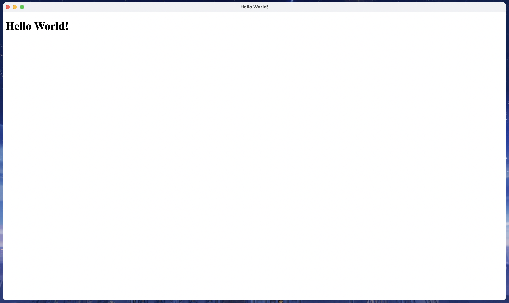

# Setup

How to setup your electron app.

Official electron doc [here](https://www.electronjs.org/docs/latest/tutorial/quick-start#create-your-application).

## Prerequisites

In order to install electron, you need [Node.js](https://github.com/nodejs/node).

**Quick install:**

```bash
# installs nvm (Node Version Manager)
curl -o- https://raw.githubusercontent.com/nvm-sh/nvm/v0.39.7/install.sh | bash

# download and install Node.js
nvm install 20

# verifies the right Node.js version is in the environment
node -v # should print `v20.13.1`

# verifies the right NPM version is in the environment
npm -v # should print `10.5.2`
```

More methods of downloading [here](https://nodejs.org/en/download/package-manager).

## Initiate App Directory

Creating project directory and installing electron.

### Create Project Directory

Before installing electron, a project directory where you would be building your app would be required.

```sh
mkdir my-electron-app && cd my-electron-app
npm init
```

```npm init``` would prompt information to be inputted. Everything can be edited later on. Just make sure that:

- ```entry point``` is ```main.js```

```author``` and ```description``` would be important when you are packing up your app, but it won't be discussed in this tutorial.

After setting up ```npm init```, you should find a ```package.json``` file in your directory, along with several other files or directories.

```package.json``` should look something like this:

```json
{
  "name": "my-electron-app",
  "version": "1.0.0",
  "description": "Your Descript Here",
  "main": "main.js",
  "author": "Your Name Here",
  "license": "MIT"
}
```

### Install Electron

Install electron as one of your project dependencies:

```sh
npm install electron --save-dev
```

The above command should automatically update your ```package.json``` to include electron as well.

### Configure To Run

Finally, in order to have your electron app executable, add a ```start``` command to your ```package.json```:

```json
"scripts": {
  "start": "electron ."
},
```

This simple command allows you to start your electron app in development mode.

I personally like to use ```electron --trace-warnings .``` rather than ```electron .```. This outputs the errors and warnings in the console.

Now to run your electron app, simply run:

```zh
npm start
```

in your project root directory.

At this point in time, running this command would throw an error as the entrance point ```main.js``` has not been setup yet.

### Double-Check

Make sure your ```package.json``` look something like this:

```json
{
  "name": "my-electron-app",
  "version": "1.0.0",
  "description": "Your Descript Here",
  "main": "main.js",
  "author": "Your Name Here",
  "license": "MIT",
  "scripts": {
    "start": "electron --trace-warnings ."
  },
  "devDependencies": {
    "electron": "^29.2.0"
  }
}
```

## Add Pages To App

The project directory has been initiated, it's time for adding actual content.

### Configure Entrance Point

As previously mentioned, the electron app enters at ```main.js```. Manually create a file named ```main.js``` in the project root folder. 

> Note that ```main.js``` runs in the ```Node.js``` environment, this is helpful for local storage later on.

Now if you run ```npm start``` again, no errors should be thrown but nothing would happen. We would have to add some code into ```main.js```.

### Configure Webpage

Before adding code into ```main.js``` though, we need something to display.

Electron's general purpose is turning webpages into applications. Let's create a sample webpage so we can see actually see something when running the app. Create ```index.html``` in the project root folder, and put the following sample **html** code:

```html
<!DOCTYPE html>
<html lang="en">
  <head>
    <meta charset="UTF-8">
      <!-- https://developer.mozilla.org/en-US/docs/Web/HTTP/CSP -->
      <meta http-equiv="Content-Security-Policy" content="default-src 'self'; script-src 'self'">
      <title>Hello World!</title>
    </head>
    <body>
      <h1>Hello World!</h1>
    </body>
</html>
```

Any other **html** code would work as well.

### Link ```main.js``` With ```index.html```

We have a webpage for display now, let's have our app display that webpage on run.
In order to do so, we simply have to have ```main.js``` open a window which shows the content of ```index.html``` on run.

Add the following to ```main.js```:

```js
//importing modules
const { app, BrowserWindow } = require('electron');

//function for creating a window that renders 'index.html'
const createWindow = () => {
  const win = new BrowserWindow({
    width: 800,
    height: 600
  });

  win.loadFile('index.html');
}

//run the createWindow function on startup
app.whenReady().then(() => {
  createWindow();
})
```

If you run ```npm start``` now, a window with ```index.html``` should render!

You have now learned the basics of electron, congratulations!

## Final Checklist

Just to make sure everything is setup correctly, here are a few things to check off.

### Project Structure

```
.
├── index.html
├── main.js
├── package-lock.json
└── package.json
```

```node_modules``` directory is omitted due to the excessive amount of content in there, it should still exist in the project directory.

### Result After ```npm start```



### Trouble Shoot

Refer back to specific sections of this tutorial if the result isn't as expected.
